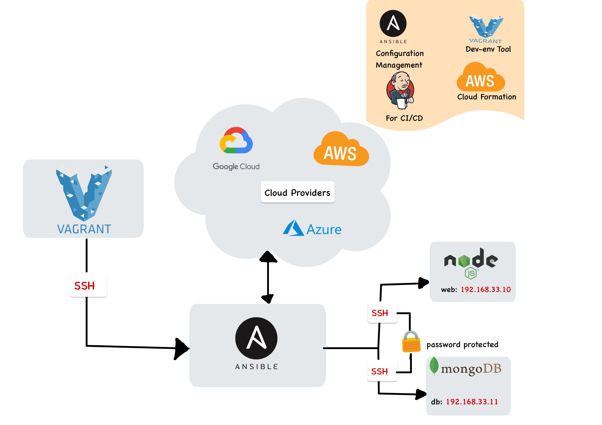

# IaC Configutartion Management with Ansible

## Infastructure as Code (IaC)
Largely up till now, we have mostly been doing mutable environments. We SSH in, run bash scripts, restart server and get it to the place the machines need to be.

- **Infrastructure as Code (IaC)** is the managing and provisioning of infrastructure through code instead of through manual processes. 

- IaC is an important part of implementing DevOps practices and continuous integration/continuous delivery (CI/CD). IaC takes away the majority of provisioning work from developers, who can execute a script to have their infrastructure ready to go.  

Benefits:
- Cost reduction
- Increase in speed of deployments
- Reduce errors 
- Improve infrastructure consistency
- Eliminate configuration drift

IaC has two parts:
- Configuartion Mangement: 
  - They help configure and test machines to a specific state.
  - Systems - Puppet, Chef and ansible
- Orchestration:
  - These tools focus on networking and architecture rather than the configuration of individual machines. 
  - Terraform, Ansible

## Ansible 
- Ansible is the fastest growing python-based open source IT automation tool that can be used to configure/manage systems, deploy applications and provision infrastructure on numerous cloud platforms. 

Benefits :

- Save time
- Open source
- Makes configuration management predictable
- Cost effective

Why use it:

- Ansible is angentless because we only need to have ansible installed on the controller. 
- We connect using SSH - this also adds to its simplicity


### Architecture of Ansible Cloud Integration


**Modules**
- Modules are script-like programs written to specify the desired state of the system. These are typically written in a code editor. 

- Modules are part of a larger program called Playbook. 

-  Ansible module is a standalone script that can be used inside an Ansible Playbook.

**Inventory**
- Ansible reads information about the machines you manage from the inventory. 

- Inventory is listed in the file which contains IP addresses, databases, and servers.

Example of an Inventory file:
```
---
[webservers]
www1.example.com
www2.example.com

[dbservers]
db0.example.com
db1.example.com
```

**Playbooks**
- Playbooks describe the tasks to be done by declaring configurations in order to bring a managed node into the desired state.

- Playbooks are files written in YAML - Yet Another markup Language.

- Syntax starts with 3 dashes and then a list of plays

Example of Playbook:
```
---
- hosts: webservers
  serial: 5 # update 5 machines at a time
  roles:
  - common
  - webapp

- hosts: content_servers
  roles:
  - common
  - content

```

## Ansible Set-up




### Connecting to hosts

- ssh into the ansible controller machine 

- Install Depoendencies:

```
sudo apt-get update
	
sudo apt-get install software-properties-common
	
sudo apt-add-repository ppa:ansible/ansible
	
sudo apt-get update
	
sudo apt-get install ansible

sudo apt-get install tree
```

- cd into `/etc/ansible/hosts` so we can connect to web and db hosts using the private ip

```
[web]
192.168.33.10 ansible_connection=ssh ansible_ssh_user=vagrant ansible_ssh_pass=vagrant
 
[db]
192.168.33.11 ansible_connection=ssh ansible_ssh_user=vagrant ansible_ssh_pass=vagrant
 
```
The command to check connections 

- `ansible all -m ping` - all host
- `ansible web -m ping` - specific host

### Ansble ad-hoc command

Ansible ad-hoc commands can be used in our ansible controller to communicated with our hosts. 


- check date: `ansible all -a date`

- check memory: ` ansible all -m shell -a "free -m"`

- get uptime `ansible all -a uptime --become` `ansible all -m shell -a uptime`

- reboot ``

- update and upgrade environments

```
ansible host_a -m apt -a "upgrade=yes update_cache=yes" --become

```

### Creating Playbook

`sudo nano nginx_playbook.yml`

```
# Playbook to install nginx installation
# Written in YAML and starts with ---

---

# hosts dName of host 
- hosts: web
# host info 
  gather_facts: yes
# admin access
  become: true
# instructions using task modules
  tasks:
  - name: Install Nginx
# nginx
    apt: pkg=nginx state=present update_cache=yes
# ensure its active
# update cache
# restart nginx

```
- `ansible-playbook nginx_playbook.yml`

- `ansible web -m shell -a "systemctl status nginx"`

## Activity 

- create a playbook to install nodejs with required dependencies, 
- configure the reverse proxy and 
- node app should be running on web ip without the port 3000.
- playbook should get your code to web

# Creating an EC2 Instance via Ansible

##### 1) First, spin up a Virtual Machine. I have created a VM called Ansible in this demonstration.

##### 2) Then ssh inside the virtual machine previously created. ``` vagrant ssh ansible ```

##### 3) Once inside go ahead and install all Pre-requisites needed for Ansible. The commands can be seen below:

```
sudo apt update

sudo apt install software-properties-common

sudo apt-add-repository --yes --update ppa:ansible/ansible

sudo apt install ansible
```
##### You can also install tree to present the files in more aesthetically pleasing manner
```
sudo apt-get install tree
``` 

##### 4) Once ansible in installed we can now start downloading the EC2 module dependencies. They can be seen below:
```
sudo apt install python

sudo apt install python-pip -y

sudo pip install --upgrade pip

sudo pip install boto

sudo pip install boto3
```
##### 5) Once all dependencies are installed we can now move on to the SSH key creation.

```
ssh-keygen -t rsa -b 4096 -f ~/.ssh/<Your_Name>_aws
```

##### 6) Now we can create the Ansible directory structure. The code for this can be seen below:
```
mkdir -p AWS_Ansible/group_vars/all/
cd AWS_Ansible
touch playbook.yml
```

##### 7) Now we can edit the vault and store the EC2 secret and access keys
```
ansible-vault create group_vars/all/pass.yml
```

##### You will be prompted to enter a pass phrase 

##### 8) Once inside you will need to click ```i``` in order to insert and then paste in the following code
```
ec2_access_key: <Your_Access_Key>                                     
ec2_secret_key: <Your_Secret_Key>
```


##### Once the keys are added. To exit press ```ESC``` ```SHIFT + ``` ```:W``` ```:Q```

##### 9) Next we nano inside our playbook
``` sudo nano playbook.yml ```


##### paste the following code but change the parts where required.

```
# AWS playbook
---

- hosts: localhost
  connection: local
  gather_facts: False

  vars:
    key_name: eng89_devops
    region: eu-west-1
    image: ami-0f18a434af2396095
    id: "brittany-web-app"
    sec_group: "sg-0fd35716aff10defa"
    subnet_id: "subnet-01cca3b390eb0a782"
  tasks:

    - name: Facts
      block:

      - name: Get instances facts
        ec2_instance_facts:
          aws_access_key: "{{ec2_access_key}}"
          aws_secret_key: "{{ec2_secret_key}}"
          region: "{{ region }}"
        register: result

      - name: Instances ID
        debug:
          msg: "ID: {{ item.instance_id }} - State: {{ item.state.name }} - Public DNS: {{ item.publi$
        loop: "{{ result.instances }}"

      tags: always


    - name: Provisioning EC2 instances
      block:

      - name: Upload public key to AWS
        ec2_key:
          name: "{{ key_name }}"
          key_material: "{{ lookup('file', '~/.ssh/{{ key_name }}.pub') }}"
          region: "{{ region }}"
          aws_access_key: "{{ec2_access_key}}"
          aws_secret_key: "{{ec2_secret_key}}"


      - name: Provision instance(s)
        ec2:
          aws_access_key: "{{ec2_access_key}}"
          aws_secret_key: "{{ec2_secret_key}}"
          assign_public_ip: true
          key_name: "{{ key_name }}"
          id: "{{ id }}"
          vpc_subnet_id: "{{ subnet_id }}"
          group_id: "{{ sec_group }}"
          image: "{{ image }}"
          instance_type: t2.micro
          region: "{{ region }}"
          wait: true
          count: 1
          instance_tags:
            Name: eng89_brittany_ansible_app

      tags: ['never', 'create_ec2']


```

##### 10) Navigate to the directory where your pass.yml file is located.

```
cd /home/vagrant/AWS_Ansible/group_vars/all
```
##### 11) add reading a writing permissions to the pass.yml file

```
sudo chmod 666 pass.yml
```

##### 12) Then navigate back to the root
```
/home/vagrant/AWS_Ansible
```

##### 13 ) Once here run the following command: This will run the playbook and create the EC2 instance

```
ansible-playbook playbook.yml --ask-vault-pass --tags create_ec2
```

##### 14) Once the instance has been created we can now ssh inside using the Public DNS (IPv4) created

```
ssh -i ~/.ssh/my_aws ubuntu@ec2-ip.eu-west-1.compute.amazonaws.com
```

