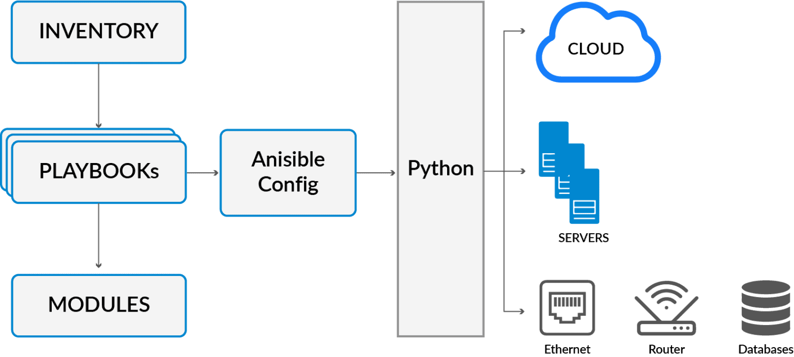

# IaC Configutartion Management with Ansible

## Infastructure as Code (IaC)
Largely up till now, we have mostly been doing mutable environments. We SSH in, run bash scripts, restart server and get it to the place the machines need to be.

- **Infrastructure as Code (IaC)** is the managing and provisioning of infrastructure through code instead of through manual processes. 

- IaC is an important part of implementing DevOps practices and continuous integration/continuous delivery (CI/CD). IaC takes away the majority of provisioning work from developers, who can execute a script to have their infrastructure ready to go.  

Benefits:
- Cost reduction
- Increase in speed of deployments
- Reduce errors 
- Improve infrastructure consistency
- Eliminate configuration drift


## Ansible 
- Ansible is the fastest growing python-based open source IT automation tool that can be used to configure/manage systems, deploy applications and provision infrastructure on numerous cloud platforms. 

### Architecture of Ansible Cloud Integration


**Modules**
- Modules are script-like programs written to specify the desired state of the system. These are typically written in a code editor. 

- Modules are part of a larger program called Playbook. 

-  Ansible module is a standalone script that can be used inside an Ansible Playbook.

**Inventory**
- Ansible reads information about the machines you manage from the inventory. 

- Inventory is listed in the file which contains IP addresses, databases, and servers.

Example of an Inventory file:
```
---
[webservers]
www1.example.com
www2.example.com

[dbservers]
db0.example.com
db1.example.com
```

**Playbooks**
- Playbooks describe the tasks to be done by declaring configurations in order to bring a managed node into the desired state.

- Playbooks are files written in YAML.

- Syntax starts with 3 dashes and then a list of plays

Example of Playbook:
```
---
- hosts: webservers
  serial: 5 # update 5 machines at a time
  roles:
  - common
  - webapp

- hosts: content_servers
  roles:
  - common
  - content

```

## Ansible Set-up
